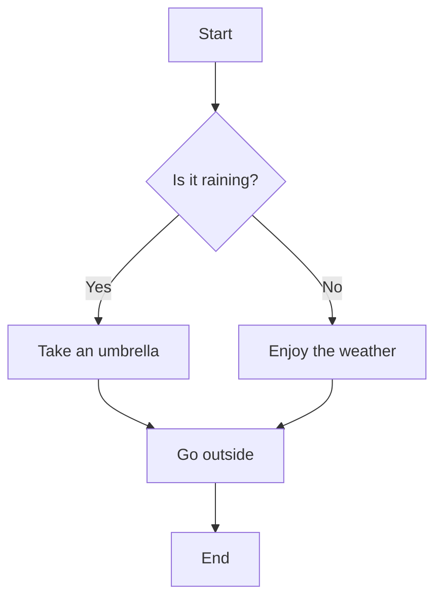
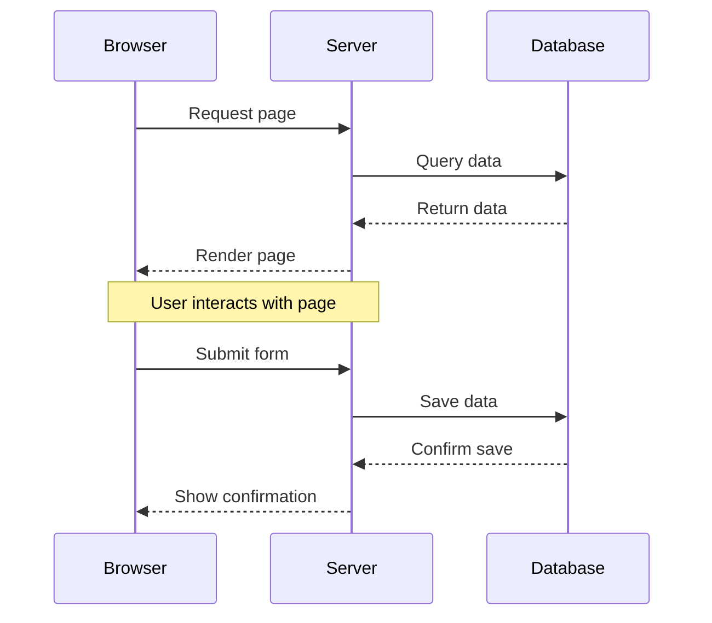
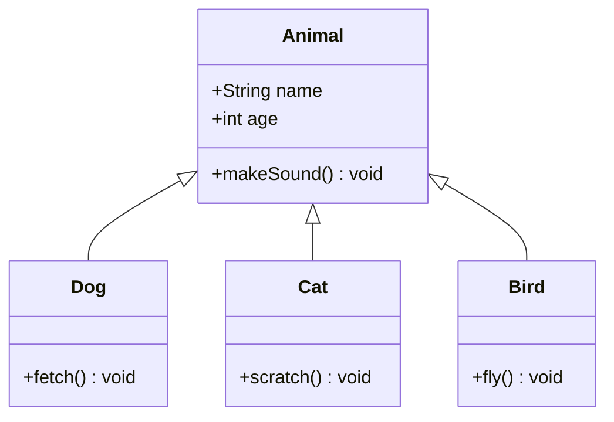
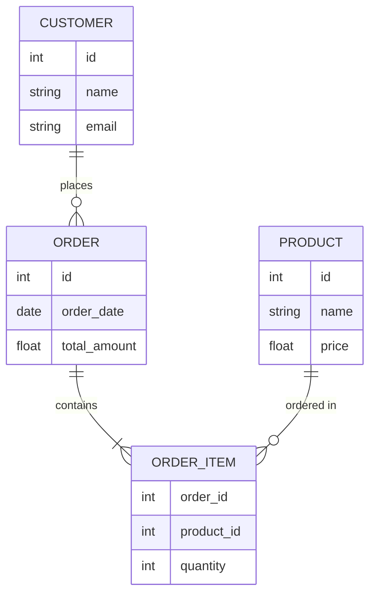
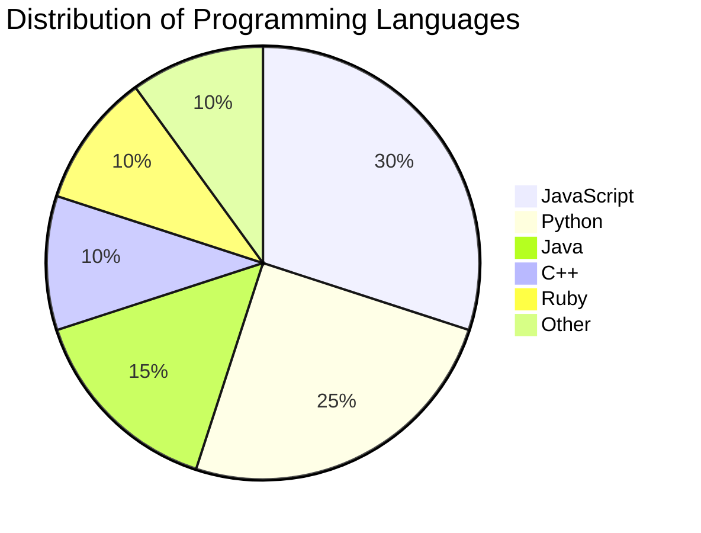

# Ultimate Markdown Test File

This document demonstrates all the Markdown features supported by the renderer.

## Basic Markdown Syntax

### Text Formatting

*This text is italicized* and _so is this text_.

**This text is bold** and __so is this text__.

***This text is bold and italic*** and ___so is this text___.

~~This text has a strikethrough.~~

This is `inline code` within text.

### Blockquotes

> This is a simple blockquote.
>
> > This is a nested blockquote.
> >
> > > And this is even more nested.

### Lists

#### Unordered Lists

* Item 1
* Item 2
  * Subitem 2.1
  * Subitem 2.2
    * Subsubitem 2.2.1
* Item 3

#### Ordered Lists

1. First item
2. Second item
   1. Subitem 2.1
   2. Subitem 2.2
3. Third item

#### Task Lists

- [x] Completed task
- [ ] Incomplete task
- [x] Another completed task
- [ ] Another incomplete task

### Horizontal Rule

---

### Links

[Link to Google](https://www.google.com)

[Link with Title](https://www.example.com "Example Website")

Automatic link: https://www.example.com

### Images


## Advanced Markdown Features

### Tables

| Header 1 | Header 2 | Header 3 |
|----------|----------|----------|
| Cell 1   | Cell 2   | Cell 3   |
| Cell 4   | Cell 5   | Cell 6   |
| Cell 7   | Cell 8   | Cell 9   |

#### Aligned Tables

| Left-aligned | Center-aligned | Right-aligned |
|:-------------|:--------------:|---------------:|
| Left         |     Center     |          Right |
| Left again   |  Center again  |    Right again |

### Footnotes

Here is a sentence with a footnote.[^1]

[^1]: This is the footnote content.

Here is another sentence with a footnote.[^2]

[^2]: This is the second footnote content, with multiple paragraphs.
    
    Indent paragraphs to include them in the footnote.
    
    You can also include code blocks.
    
    ```python
    print("Hello from a footnote!")
    ```

### Definition Lists

Term 1
: Definition 1

Term 2
: Definition 2a
: Definition 2b

### Abbreviations

*[HTML]: Hyper Text Markup Language
*[CSS]: Cascading Style Sheets

HTML and CSS are web technologies.

## Code Blocks

### Plain Code Block

```
This is a plain code block without syntax highlighting.
It can contain any text.
```

### Syntax Highlighted Code Blocks

#### JavaScript

```javascript
function greet(name) {
  console.log(`Hello, ${name}!`);
  return `Hello, ${name}!`;
}

// Object example
const person = {
  firstName: "John",
  lastName: "Doe",
  age: 30,
  hobbies: ["reading", "coding", "hiking"],
  address: {
    street: "123 Main St",
    city: "Anytown",
    country: "USA"
  }
};

// Array methods
const numbers = [1, 2, 3, 4, 5];
const doubled = numbers.map(n => n * 2);
const sum = numbers.reduce((total, n) => total + n, 0);

// Class example
class Rectangle {
  constructor(height, width) {
    this.height = height;
    this.width = width;
  }
  
  calculateArea() {
    return this.height * this.width;
  }
  
  get area() {
    return this.calculateArea();
  }
}
```

#### Python

```python
def factorial(n):
    """
    Calculate the factorial of a number using recursion.
    
    Args:
        n (int): The number to calculate factorial for
        
    Returns:
        int: The factorial of n
    """
    if n <= 1:
        return 1
    return n * factorial(n - 1)

# List comprehensions
squares = [x**2 for x in range(10)]
even_squares = [x**2 for x in range(10) if x % 2 == 0]

# Dictionary comprehension
word_lengths = {word: len(word) for word in ["hello", "world", "python"]}

# Class with inheritance
class Animal:
    def __init__(self, name):
        self.name = name
    
    def speak(self):
        raise NotImplementedError("Subclasses must implement this!")

class Dog(Animal):
    def speak(self):
        return f"{self.name} says Woof!"
        
class Cat(Animal):
    def speak(self):
        return f"{self.name} says Meow!"

# Using a context manager
with open("example.txt", "w") as file:
    file.write("Hello, World!")
```

#### HTML/CSS/JS

```html
<!DOCTYPE html>
<html lang="en">
<head>
    <meta charset="UTF-8">
    <meta name="viewport" content="width=device-width, initial-scale=1.0">
    <title>Example Page</title>
    <style>
        body {
            font-family: Arial, sans-serif;
            line-height: 1.6;
            color: #333;
            max-width: 800px;
            margin: 0 auto;
            padding: 20px;
        }
        
        h1 {
            color: #0066cc;
            border-bottom: 2px solid #eee;
            padding-bottom: 10px;
        }
        
        .container {
            display: flex;
            flex-wrap: wrap;
            gap: 20px;
        }
        
        .card {
            border: 1px solid #ddd;
            border-radius: 4px;
            padding: 20px;
            flex: 1 1 300px;
            box-shadow: 0 2px 4px rgba(0,0,0,0.1);
        }
        
        @media (max-width: 600px) {
            .card {
                flex: 1 1 100%;
            }
        }
    </style>
</head>
<body>
    <h1>Welcome to My Page</h1>
    
    <div class="container">
        <div class="card">
            <h2>Card 1</h2>
            <p>This is some content for the first card.</p>
            <button id="card1-btn">Click Me</button>
        </div>
        
        <div class="card">
            <h2>Card 2</h2>
            <p>This is some content for the second card.</p>
            <button id="card2-btn">Click Me</button>
        </div>
    </div>
    
    <script>
        document.getElementById('card1-btn').addEventListener('click', function() {
            alert('You clicked the button on Card 1!');
        });
        
        document.getElementById('card2-btn').addEventListener('click', function() {
            alert('You clicked the button on Card 2!');
        });
    </script>
</body>
</html>
```

#### Java

```java
import java.util.ArrayList;
import java.util.List;
import java.util.stream.Collectors;

public class StreamExample {
    public static void main(String[] args) {
        // Create a list of Person objects
        List<Person> people = new ArrayList<>();
        people.add(new Person("Alice", 25));
        people.add(new Person("Bob", 30));
        people.add(new Person("Charlie", 35));
        people.add(new Person("Dave", 40));
        
        // Use streams to filter and transform data
        List<String> namesOfPeopleOver30 = people.stream()
            .filter(person -> person.getAge() > 30)
            .map(Person::getName)
            .collect(Collectors.toList());
        
        // Print the results
        System.out.println("Names of people over 30:");
        namesOfPeopleOver30.forEach(System.out::println);
        
        // Calculate the average age
        double averageAge = people.stream()
            .mapToInt(Person::getAge)
            .average()
            .orElse(0.0);
        
        System.out.println("Average age: " + averageAge);
    }
}

class Person {
    private final String name;
    private final int age;
    
    public Person(String name, int age) {
        this.name = name;
        this.age = age;
    }
    
    public String getName() {
        return name;
    }
    
    public int getAge() {
        return age;
    }
    
    @Override
    public String toString() {
        return "Person{name='" + name + "', age=" + age + "}";
    }
}
```

#### C/C++

```cpp
#include <iostream>
#include <vector>
#include <algorithm>
#include <memory>

// A template class
template <typename T>
class Stack {
private:
    std::vector<T> elements;
    
public:
    void push(const T& element) {
        elements.push_back(element);
    }
    
    T pop() {
        if (elements.empty()) {
            throw std::out_of_range("Stack is empty");
        }
        
        T top = elements.back();
        elements.pop_back();
        return top;
    }
    
    bool empty() const {
        return elements.empty();
    }
    
    size_t size() const {
        return elements.size();
    }
};

// Smart pointers and lambda functions
int main() {
    // Using unique_ptr for automatic memory management
    auto ptr = std::make_unique<int>(42);
    std::cout << "Value: " << *ptr << std::endl;
    
    // Using a lambda function with auto
    auto add = [](auto a, auto b) { return a + b; };
    std::cout << "5 + 3 = " << add(5, 3) << std::endl;
    std::cout << "5.5 + 3.5 = " << add(5.5, 3.5) << std::endl;
    
    // Using our Stack template class
    Stack<std::string> stringStack;
    stringStack.push("Hello");
    stringStack.push("World");
    
    while (!stringStack.empty()) {
        std::cout << stringStack.pop() << std::endl;
    }
    
    return 0;
}
```

#### Ruby

```ruby
# A simple class
class Person
  attr_accessor :name, :age
  
  def initialize(name, age)
    @name = name
    @age = age
  end
  
  def greeting
    "Hello, my name is #{@name} and I am #{@age} years old."
  end
  
  # Class method
  def self.create_from_hash(hash)
    new(hash[:name], hash[:age])
  end
end

# Using blocks and yield
def repeat(times)
  times.times { yield }
end

repeat(3) { puts "Hello, World!" }

# Symbol to proc shorthand
(1..5).map(&:to_s)  # => ["1", "2", "3", "4", "5"]

# Hash with symbol keys
person_data = {
  name: "John",
  age: 30,
  occupation: "Developer"
}

# String interpolation and multi-line strings
message = <<-MSG
  Welcome to Ruby!
  The current time is #{Time.now}
  Enjoy your day!
MSG

puts message
```

#### SQL

```sql
-- Create a table
CREATE TABLE employees (
    employee_id INT PRIMARY KEY,
    first_name VARCHAR(50),
    last_name VARCHAR(50),
    email VARCHAR(100) UNIQUE,
    hire_date DATE,
    salary DECIMAL(10, 2),
    department_id INT,
    FOREIGN KEY (department_id) REFERENCES departments(department_id)
);

-- Insert data
INSERT INTO employees (employee_id, first_name, last_name, email, hire_date, salary, department_id)
VALUES (1, 'John', 'Doe', 'john.doe@example.com', '2020-01-15', 75000.00, 1);

-- Select with join
SELECT 
    e.employee_id,
    e.first_name,
    e.last_name,
    d.department_name,
    e.salary
FROM 
    employees e
INNER JOIN 
    departments d ON e.department_id = d.department_id
WHERE 
    e.salary > 50000
ORDER BY 
    e.salary DESC;

-- Subquery example
SELECT 
    employee_id,
    first_name,
    last_name,
    salary
FROM 
    employees
WHERE 
    salary > (SELECT AVG(salary) FROM employees)
ORDER BY 
    salary;

-- Common Table Expression (CTE)
WITH department_salaries AS (
    SELECT 
        department_id,
        AVG(salary) as avg_salary
    FROM 
        employees
    GROUP BY 
        department_id
)
SELECT 
    d.department_name,
    ds.avg_salary
FROM 
    department_salaries ds
JOIN 
    departments d ON ds.department_id = d.department_id
ORDER BY 
    ds.avg_salary DESC;
```

## Math Expressions

### Inline Math

The quadratic formula is $x = \frac{-b \pm \sqrt{b^2 - 4ac}}{2a}$.

The area of a circle is $A = \pi r^2$.

The famous equation $E = mc^2$ by Einstein.

### Block Math

The Pythagorean theorem:

$$a^2 + b^2 = c^2$$

The Gaussian integral:

$$\int_{-\infty}^{\infty} e^{-x^2} dx = \sqrt{\pi}$$

The standard normal distribution:

$$f(x) = \frac{1}{\sigma\sqrt{2\pi}} e^{-\frac{1}{2}\left(\frac{x-\mu}{\sigma}\right)^2}$$

Maxwell's equations in differential form:

$$
\begin{align}
\nabla \cdot \vec{E} &= \frac{\rho}{\varepsilon_0} \\
\nabla \cdot \vec{B} &= 0 \\
\nabla \times \vec{E} &= -\frac{\partial \vec{B}}{\partial t} \\
\nabla \times \vec{B} &= \mu_0 \vec{J} + \mu_0 \varepsilon_0 \frac{\partial \vec{E}}{\partial t}
\end{align}
$$

A matrix:

$$
\begin{pmatrix}
a & b & c \\
d & e & f \\
g & h & i
\end{pmatrix}
$$

A system of equations:

$$
\begin{cases}
3x + 5y + z = 8 \\
3x - 2y + 6z = 12 \\
2x + 3y - 4z = -6
\end{cases}
$$

## Mermaid Diagrams

### Flowchart



### Sequence Diagram



### Class Diagram



### Entity Relationship Diagram



### Gantt Chart

```mermaid
gantt
    title Project Schedule
    dateFormat  YYYY-MM-DD
    
    section Planning
    Research           :a1, 2023-01-01, 10d
    Requirements       :a2, after a1, 5d
    
    section Design
    UI/UX Design       :b1, after a2, 15d
    Architecture       :b2, after a2, 10d
    
    section Development
    Frontend           :c1, after b1, 20d
    Backend            :c2, after b2, 25d
    
    section Testing
    Unit Tests         :d1, after c1, 5d
    Integration Tests  :d2, after c2, 5d
    User Acceptance    :d3, after d1, after d2, 10d
```

### Pie Chart



### State Diagram

```mermaid
stateDiagram-v2
    [*] --> "Idle"
    "Idle" --> "Processing": Start
    "Processing" --> "Success": Complete
    "Processing" --> "Failed": Error
    "Success" --> "Idle": Reset
    "Failed" --> "Idle": Reset
    "Success" --> [*]
    "Failed" --> [*]
```

## Custom Containers

::: info
This is an information block.
It can contain multiple paragraphs.

- It can contain lists
- And other markdown elements

```python
# Even code blocks!
print("Hello from info block!")
```
:::

::: warning
This is a warning block.
Be careful with this information!
:::

::: danger
This is a danger block.
This could cause serious problems!
:::

::: tip
This is a tip block.
Here's a helpful suggestion!
:::

::: success
This is a success block.
Congratulations, everything worked!
:::

## Combining Features

Here's an example combining various features:

::: info Math and Code Together
The solution to the quadratic equation $ax^2 + bx + c = 0$ is:

$$x = \frac{-b \pm \sqrt{b^2 - 4ac}}{2a}$$

We can implement this in JavaScript:

```javascript
function solveQuadratic(a, b, c) {
  const discriminant = b*b - 4*a*c;
  
  if (discriminant < 0) {
    return "No real solutions";
  } else if (discriminant === 0) {
    return [-b / (2*a)];
  } else {
    const sqrtDiscriminant = Math.sqrt(discriminant);
    return [
      (-b + sqrtDiscriminant) / (2*a),
      (-b - sqrtDiscriminant) / (2*a)
    ];
  }
}

console.log(solveQuadratic(1, -3, 2)); // [2, 1]
```
:::

And here's a mermaid diagram showing the process:

```mermaid
graph TD
    A[Start] --> B{Is the discriminant < 0?}
    B -->|Yes| C[No real solutions]
    B -->|No| D{Is the discriminant = 0?}
    D -->|Yes| E[One solution: -b / (2a)]
    D -->|No| F[Two solutions: (-b ± sqrt(discriminant)) / (2a)]
    C --> G[End]
    E --> G
    F --> G
```

## References and Resources

* [Official Markdown Guide](https://www.markdownguide.org/)
* [GitHub Flavored Markdown Spec](https://github.github.com/gfm/)
* [KaTeX Documentation](https://katex.org/docs/supported.html)
* [Mermaid Documentation](https://mermaid-js.github.io/mermaid/#/)

---

That's it! This document demonstrates all the major Markdown features supported by the renderer.