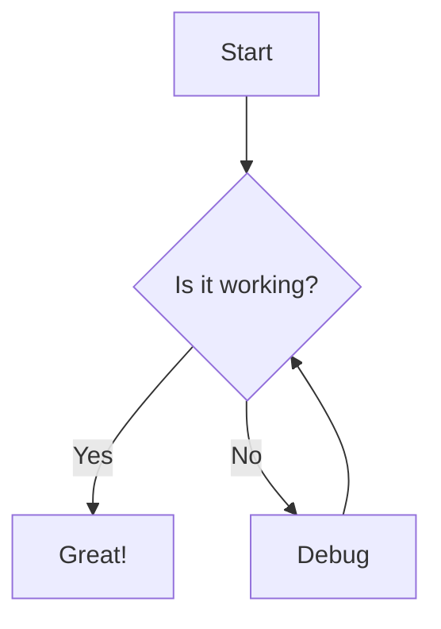
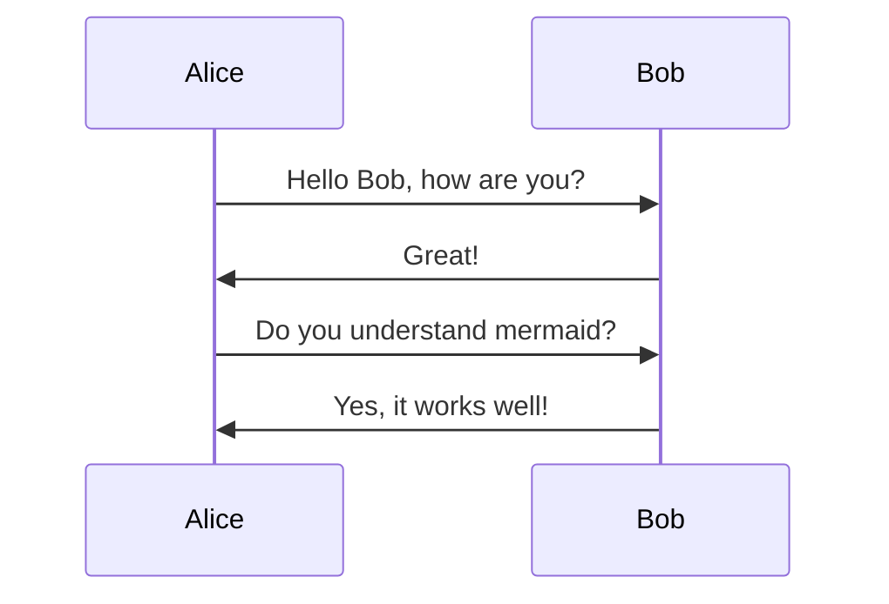
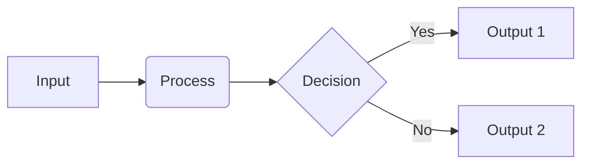

# Mathematics Renderer Test Document

This document is designed to test all the advanced features of our enhanced mathematics renderer. It contains a variety of mathematical expressions, environments, and diagrams to verify proper rendering.

## Basic Inline Mathematics

Let's start with some basic inline mathematics:

- The Pythagorean theorem: $a^2 + b^2 = c^2$
- Einstein's famous equation: $E = mc^2$
- The quadratic formula: $x = \frac{-b \pm \sqrt{b^2 - 4ac}}{2a}$
- A simple integral: $\int_0^1 x^2 \, dx = \frac{1}{3}$
- Partial derivatives: $\frac{\partial f}{\partial x}$
- A fraction within a fraction: $\frac{1 + \frac{a}{b}}{1 + \frac{c}{d}}$

## Display Mathematics

Now let's test display mathematics with proper alignment and spacing:

$$
\int_a^b f(x) \, dx = F(b) - F(a)
$$

The Cauchy-Schwarz inequality:

$$
\left( \sum_{k=1}^n a_k b_k \right)^2 \leq \left( \sum_{k=1}^n a_k^2 \right) \left( \sum_{k=1}^n b_k^2 \right)
$$

A complex fraction with multiple terms:

$$
\frac{1}{\Bigl(\sqrt{\phi \sqrt{5}}-\phi\Bigr) e^{\frac{2}{5}\pi}} = 1 + \frac{e^{-2\pi}} {1 + \frac{e^{-4\pi}} {1 + \frac{e^{-6\pi}} {1 + \frac{e^{-8\pi}} {1 + \ldots} } } }
$$

## Equation Numbering

Let's test equation numbering with the tag command:

$$
\nabla \times \vec{B} - \frac{1}{c}\frac{\partial\vec{E}}{\partial t} = \frac{4\pi}{c}\vec{j} \tag{1}
$$

$$
\nabla \cdot \vec{E} = 4 \pi \rho \tag{2}
$$

$$
\nabla \times \vec{E} + \frac{1}{c}\frac{\partial\vec{B}}{\partial t} = \vec{0} \tag{3}
$$

$$
\nabla \cdot \vec{B} = 0 \tag{4}
$$

These equations are Maxwell's equations in their classical form.

## Mathematical Environments

### Theorem

\begin{theorem}
For any right triangle, the square of the length of the hypotenuse is equal to the sum of the squares of the lengths of the other two sides.
\end{theorem}

### Lemma

\begin{lemma}
If $a|b$ and $b|c$, then $a|c$.
\end{lemma}

### Definition

\begin{definition}
A function $f: \mathbb{R} \to \mathbb{R}$ is said to be continuous at a point $x_0 \in \mathbb{R}$ if for every $\epsilon > 0$ there exists a $\delta > 0$ such that $|x - x_0| < \delta$ implies $|f(x) - f(x_0)| < \epsilon$.
\end{definition}

### Example

\begin{example}
Consider the function $f(x) = x^2$. Its derivative is $f'(x) = 2x$, which means the rate of change at any point $x$ is equal to $2x$.
\end{example}

## Complex Mathematical Expressions

### Matrix Notation

$$
A = \begin{pmatrix}
a_{11} & a_{12} & \ldots & a_{1n} \\
a_{21} & a_{22} & \ldots & a_{2n} \\
\vdots & \vdots & \ddots & \vdots \\
a_{m1} & a_{m2} & \ldots & a_{mn}
\end{pmatrix}
$$

### Commutative Diagram

$$
\require{AMScd}
\begin{CD}
A @>f>> B \\
@VgVV @VVhV \\
C @>>j> D
\end{CD}
$$

### Multiline Equation Alignment

$$
\begin{align}
(x+y)^3 &= (x+y)^2(x+y) \\
&= (x^2+2xy+y^2)(x+y) \\
&= x^3+2x^2y+xy^2+x^2y+2xy^2+y^3 \\
&= x^3+3x^2y+3xy^2+y^3
\end{align}
$$

### Chemical Equations

$$
\ce{CO2 + C -> 2CO}
$$

$$
\ce{Zn^2+ <=> Zn^2+ + 2e-}
$$

## LaTeX Macros Test

Using our predefined macros:

- The set of real numbers: $\R$
- The set of natural numbers: $\N$
- The set of integers: $\Z$
- The set of rational numbers: $\Q$
- The set of complex numbers: $\C$

Norm notation: $\norm{v}$
Inner product: $\inner{u}{v}$
Set notation: $\set{x \in \R | x > 0}$

## Mermaid Diagrams

Let's test how mermaid diagrams render with our enhanced component:

A sequence diagram:

A flowchart:

## Special Symbols and Notations

Special mathematical symbols:

$$
\forall x \in \R, \exists y \leq \epsilon \text{ such that } y = \sin(x)
$$

$$
\sum_{i=1}^{n} i = \frac{n(n+1)}{2}
$$

$$
\prod_{i=1}^{n} i = n!
$$

$$
\lim_{x \to \infty} \frac{1}{x} = 0
$$

## Customized LaTeX with Error Handling

Let's test how the renderer handles some edge cases:

$$
\frac{1}{\frac{1}{x}}
$$

Should render as $x$.

## Physics Equations

The Schrödinger equation:

$$
i\hbar\frac{\partial}{\partial t} \Psi(\mathbf{r},t) = \left [ \frac{-\hbar^2}{2\mu}\nabla^2 + V(\mathbf{r},t)\right ] \Psi(\mathbf{r},t)
$$

The Einstein field equations:

$$
R_{\mu\nu} - \frac{1}{2}g_{\mu\nu}R + g_{\mu\nu}\Lambda = \frac{8\pi G}{c^4}T_{\mu\nu}
$$

## Statistics and Probability

The normal distribution:

$$
f(x) = \frac{1}{\sigma\sqrt{2\pi}} e^{-\frac{1}{2}\left(\frac{x-\mu}{\sigma}\right)^2}
$$

Bayes' theorem:

$$
P(A|B) = \frac{P(B|A)P(A)}{P(B)}
$$

## Custom Containers

Let's test our custom containers:

::: info
This is an information block that should be styled differently.
:::

::: warning
This is a warning block that should grab attention.
:::

::: success
This block indicates a successful operation or important positive information.
:::

## Conclusion

This test document covers a wide range of mathematical expressions and features. If all elements render correctly, the enhanced mathematics renderer is working as expected.