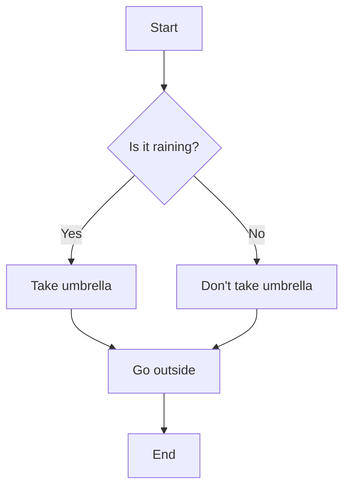
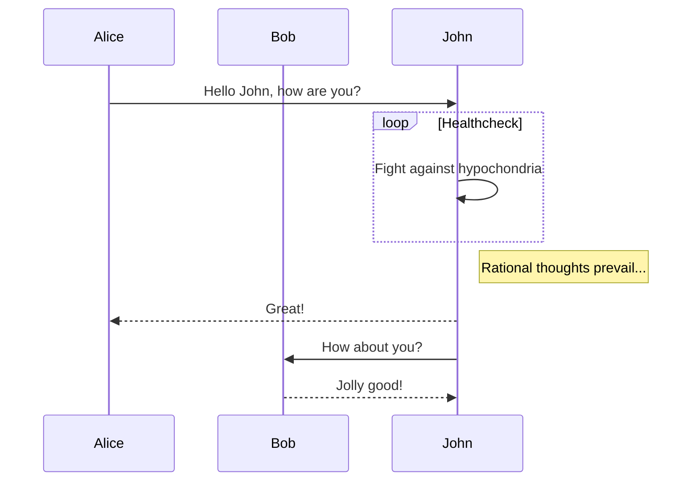
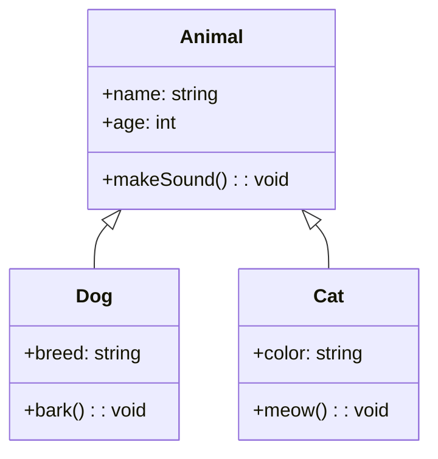
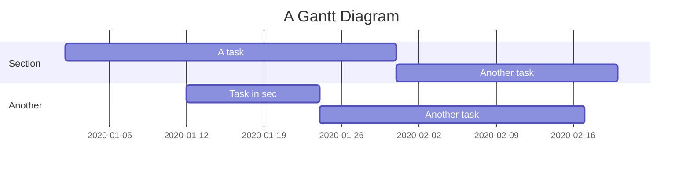
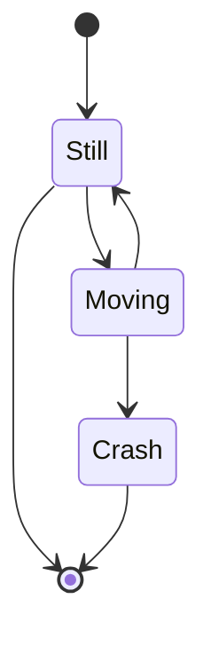
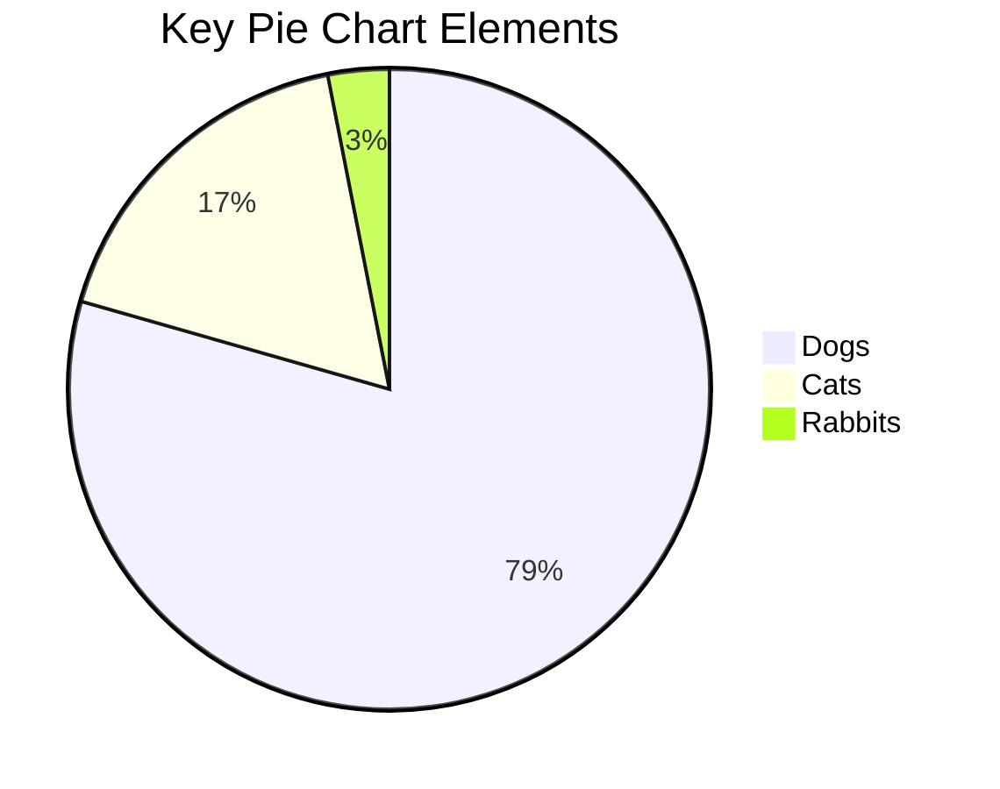
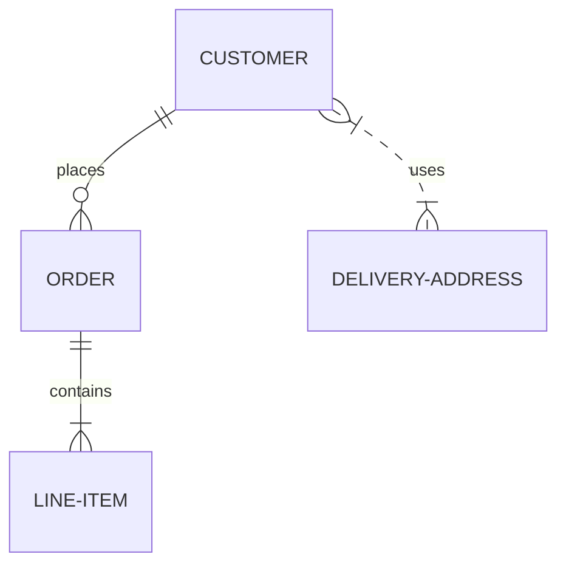

# Comprehensive Markdown Test File

This file tests all major Markdown features along with the extended syntax and custom features in your renderer.

## Basic Markdown

### Text Formatting

Plain text

**Bold text**

*Italic text*

***Bold and italic text***

~~Strikethrough text~~

<u>Underlined text</u> (HTML)

`Inline code`

Superscript: X^2^

Subscript: H~2~O

==Highlighted text==

### Links

[Basic link](https://example.com)

[Link with title](https://example.com "Example website")

<https://example.com> (Automatic link)

### Images


### Lists

#### Ordered List
1. First item
2. Second item
   1. Sub-item 1
   2. Sub-item 2
3. Third item

#### Unordered List
- Item 1
- Item 2
  - Sub-item 1
  - Sub-item 2
- Item 3

#### Task List
- [x] Completed task
- [ ] Incomplete task
- [ ] Another task

### Blockquotes

> This is a basic blockquote
>
> > This is a nested blockquote
>
> Back to the first level

### Horizontal Rule

---

### Tables

| Header 1 | Header 2 | Header 3 |
|----------|:--------:|---------:|
| Default  | Centered | Right    |
| aligned  | aligned  | aligned  |
| content  | content  | content  |

### Code Blocks

```javascript
function helloWorld() {
  console.log("Hello, world!");
  // This is a comment
  return true;
}
```

```python
def hello_world():
    """
    This is a docstring
    """
    print("Hello, world!")
    # This is a comment
    return True
```

```css
body {
  font-family: 'Arial', sans-serif;
  color: #333;
  background-color: #f5f5f5;
}
```

## Extended Syntax Features

### Footnotes

Here's a sentence with a footnote.[^1]

[^1]: This is the footnote content.

### Definition Lists

Term 1
: Definition 1

Term 2
: Definition 2a
: Definition 2b

### Abbreviations

*[HTML]: Hypertext Markup Language
*[CSS]: Cascading Style Sheets

This is an HTML page with CSS styling.

## Math Expressions

### Inline Math

Einstein's famous equation: $E = mc^2$

The quadratic formula: $x = \frac{-b \pm \sqrt{b^2 - 4ac}}{2a}$

### Block Math

The Cauchy-Schwarz Inequality:

$$
\left( \sum_{k=1}^n a_k b_k \right)^2 \leq \left( \sum_{k=1}^n a_k^2 \right) \left( \sum_{k=1}^n b_k^2 \right)
$$

Maxwell's Equations:

$$
\begin{aligned}
\nabla \times \vec{\mathbf{B}} -\, \frac1c\, \frac{\partial\vec{\mathbf{E}}}{\partial t} & = \frac{4\pi}{c}\vec{\mathbf{j}} \\
\nabla \cdot \vec{\mathbf{E}} & = 4 \pi \rho \\
\nabla \times \vec{\mathbf{E}}\, +\, \frac1c\, \frac{\partial\vec{\mathbf{B}}}{\partial t} & = \vec{\mathbf{0}} \\
\nabla \cdot \vec{\mathbf{B}} & = 0
\end{aligned}
$$

A matrix:

$$
\begin{pmatrix}
a & b & c \\
d & e & f \\
g & h & i
\end{pmatrix}
$$

## Mermaid Diagrams

### Flowchart



### Sequence Diagram



### Class Diagram



### Gantt Chart



### State Diagram



### Pie Chart



### Entity Relationship Diagram



## Custom Containers

::: info
This is an info box with important information.
It can contain multiple paragraphs.
:::

::: warning
This is a warning box that alerts the user to potential issues.
Be careful!
:::

::: danger
This is a danger box that warns of serious problems.
Proceed with extreme caution!
:::

::: tip
This is a tip box with helpful advice.
This will make your work easier.
:::

::: success
This is a success box celebrating an achievement.
Well done!
:::

## HTML Support

<details>
<summary>Click to expand</summary>
This content is hidden in a details element.

It can contain **rich** content including _formatting_.
</details>

<div style="padding: 1em; background-color: #f0f0f0; border-radius: 8px;">
  <h3>Custom HTML Container</h3>
  <p>This is a custom styled div with HTML content.</p>
  <ul>
    <li>Item 1</li>
    <li>Item 2</li>
  </ul>
</div>

## Combining Features

### Math in Tables

| Equation | Description |
|----------|-------------|
| $E = mc^2$ | Einstein's energy-mass relation |
| $F = ma$ | Newton's 2nd law |
| $e^{i\pi} + 1 = 0$ | Euler's identity |

### Code with Highlighting in Lists

1. JavaScript: 
   ```javascript
   const greeting = "Hello, world!";
   console.log(greeting);
   ```

2. Python:
   ```python
   greeting = "Hello, world!"
   print(greeting)
   ```

3. HTML:
   ```html
   <h1>Hello, world!</h1>
   <p>This is a paragraph.</p>
   ```

### Nested Features

> Here's a blockquote with a list:
> 
> 1. Item 1 with *italic* text
> 2. Item 2 with **bold** text
> 3. Item 3 with `code`
>
> And a table:
> 
> | A | B |
> |---|---|
> | 1 | 2 |
> | 3 | 4 |

## Edge Cases

### Empty Code Block

```

```

### Multiple Line Breaks


End of multiple line breaks

### Escaped Characters

\*This is not italic\*

\`This is not code\`

\# This is not a heading

### Long URL

[Very long URL](https://example.com/this/is/a/very/long/url/that/might/cause/problems/with/wrapping/on/smaller/screens/or/with/certain/configurations/of/the/markdown/renderer/so/we/should/test/it/to/make/sure/it/works/correctly/and/doesnt/break/the/layout/of/the/page/or/cause/any/other/issues/with/the/display/of/the/content)

### Large Image


### Deeply Nested Lists

1. Level 1
   - Level 2
     - Level 3
       - Level 4
         - Level 5
           - Level 6

### Complex Table

| Syntax      | Description | Test Text     | Numbers |
| :---        |    :----:   |          ---: | :---:  |
| Header      | Title       | Here's this   | 1600   |
| Paragraph   | Text        | And more      | 12     |
| With newlines and *formatting* inside | Including **bold** | `code blocks` too | $E=mc^2$ |
| Very long cell content that might cause wrapping issues on smaller screens or with certain configurations of the markdown renderer | Normal | Normal | Normal |

## Mixed Content Testing

Here's some text with $\pi \approx 3.14159$ inline math, **bold formatting**, and `inline code`.

> A blockquote with a mermaid diagram:
> 
> ```mermaid
> graph LR
>     A --> B
>     B --> C
>     C --> A
> ```

::: info
An info container with a table:

| Name | Value |
|------|-------|
| Alpha | 100 |
| Beta | 200 |
:::

## Final Section

This concludes the comprehensive test file. If your Markdown renderer can handle all these elements correctly, it should be robust enough for most use cases.

The end!